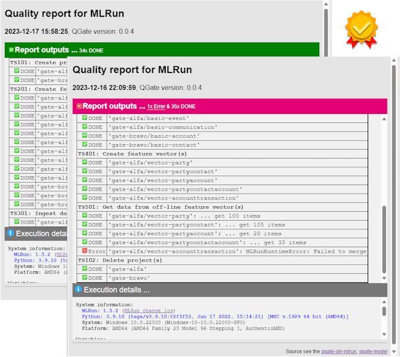

# QGate-Sln-MLRun
Quality Gate for solution MLRun (and Iguazio). The main aims of the project are:
- independent quality test (function, integration, acceptance, ... tests)
- deeper quality checks before full rollout/use in company environments
- identification of possible compatibility issues (if any)
- external and independent test coverage
- etc.

The tests use these key components, MLRun solution see **[GIT mlrun](https://github.com/mlrun/mlrun)**, 
sample meta-data model see **[GIT qgate-model](https://github.com/george0st/qgate-model)** and this project.

## Test scenarios
Quality Gate covers these test scenarios (✅ done, ❌ planned):
 - **Project**
   - ✅ TS101: Create project(s)
   - ✅ TS102: Delete project(s)
 - **Feature set**
   - ✅ TS201: Create feature set(s)
 - **Ingest data**
   - ✅ TS301: Ingest data to feature set(s)
 - **Feature vector**
   - ✅ TS401: Create feature vector(s)
 - **Get data**
   - ✅ TS501: Get data from off-line feature vector(s)
   - ❌ TS502: Get data from on-line feature vector(s)
 - **Serving ML score**
   - ❌ TS601: Serving score from CART
   - ❌ TS602: Serving score from XGBoost
   - ❌ TS603: Serving score from DNN

## Sample of outputs

## Usage

You can easy use this solution in three steps:
1. Download content of these two GIT repositories to your local environment
    - [qgate-sln-mlrun](https://github.com/george0st/qgate-sln-mlrun)
    - [qgate-model](https://github.com/george0st/qgate-model)
2. Update file `qgate-sln-mlrun.env` from qgate-model
   - Update variables for MLRun/Iguazio, see `MLRUN_DBPATH`, `V3IO_USERNAME`, `V3IO_ACCESS_KEY`, `V3IO_API`
     - setting of `V3IO_*` is needed only in case of Iguazio installation (not for pure free MLRun)
   - Update variables for QGate, see `QGATE_*`
3. Run from `qgate-sln-mlrun`
   - **python main.py**

Precondition: You have available MLRun or Iguazio solution (MLRun is part of that), see official [installation steps](https://docs.mlrun.org/en/latest/install.html)

## Tested with
The project was tested with these MLRun versions (see [change log](https://docs.mlrun.org/en/latest/change-log/index.html)):
 - **MLRun** (in Desktop Docker)
   - MLRun 1.5.2, 1.5.1, 1.5.0
   - MLRun 1.4.1
   - MLRun 1.3.0
 - **Iguazio** (k8s, on-prem with VM with VMware)
   - Iguazio 3.5.3 (with MLRun 1.4.1)
   - Iguazio 3.5.1 (with MLRun 1.3.0)
